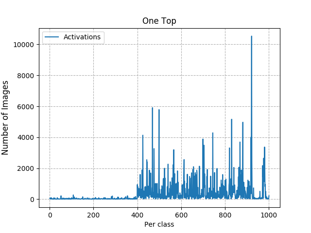
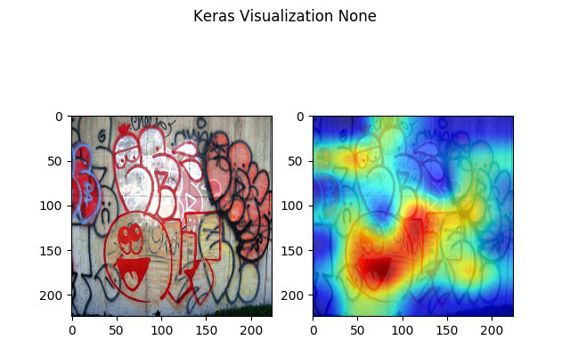
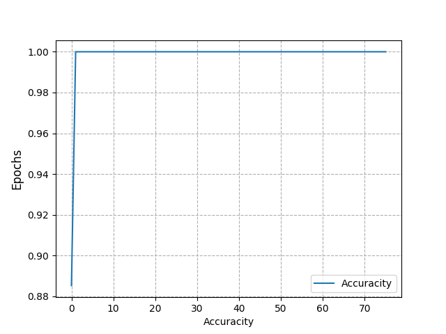
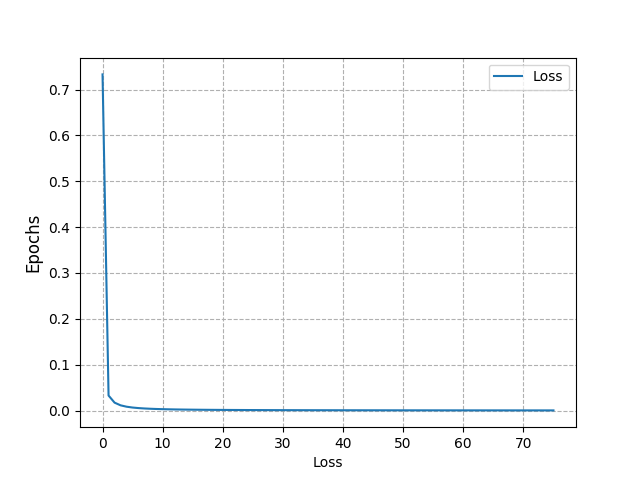

# Analyzer

The analyzer allow you see the information through any ways suchs `deep visualization`, `1-Top` activations or plot 'loss and accuracity' from train.

## 1-Top from model 

See the 1-top from model and test result.
    
    python Main.py --mode top --test_name testing_imagenet_test_set --model_name 20181210091231
    
    

*Top-1 to classe from model `20181210091231` at dataset  `testing_imagenet_test_set`*
    
    
!!! info
    before, check if you execute the [Tester](../tester/index.md) with `testing_imagenet_test_set`
    
    python Main.py --model_name 20181210091231 --load_data testing_imagenet_test_set --test_name <NAME> --epoch <NUMBER>
    
## Deep Visualization

See a deep visualization activation
    
    python Main.py --mode visualization --files ../../data/datasets/graffiti/classes/graffiti/4235365635_a5fba2a2d8_o.jpg --model_name model_example_1 --class_name freight\ car
    

    
    
## Plot Loss an Acc

Plot in images `loss` and `acc` of model

    python Main.py --mode plot --model_name 20181210091231

 Acc | Loss
:-------------------------:|:-------------------------:
  |  
    
    
!!! tip
    You can use [Visualizer](../visualizer/index.md) to see the same information about `loss` and `acc` with a webserver.
        

## Arguments

* **--mode**: if you want `top` or `visualization` 

* **--title**: title used in images or files to export

### Top arguments

* **--number_of_tops**: Set the number of top suchs 1 or 5.

* **--test_name**: Load the values predictions to top

* **--save_histogram_to_csv**: If you want save the .csv representation.

* **--save_histogram_to_png**: If you want save the .png representation.

* **--save_list_image**: If you save de list of images by class in .csv file.

* **--number_limit_to_y**: Top in chat to y. -1 do default

### Visualization arguments

* **--files**: file or list of images path to by analyze.

* **--model_name**: name of model that want load and view activations

* **--modifier**: you can choose None, 'guided', 'relu','deconv' and 'rectified'. separeted by comma if want multiple

* **--class_name**: name of classe used

* **--show_both**: show image and image with heatmap side by side

* **--epoch**: Set the epoch with weigths that you want save