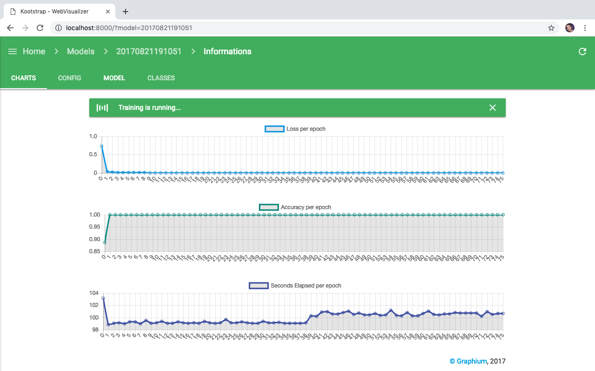

Viewing is the best way to track and visualize the training of a network. Through a web client you will be able to follow the training setup as well as the Loss and Acc.

## Start WebServer

    cd visualizer/
    python Main.py
    
Go to your browser and open [http://localhost:8000](http://localhost:8000) to see mor information.

